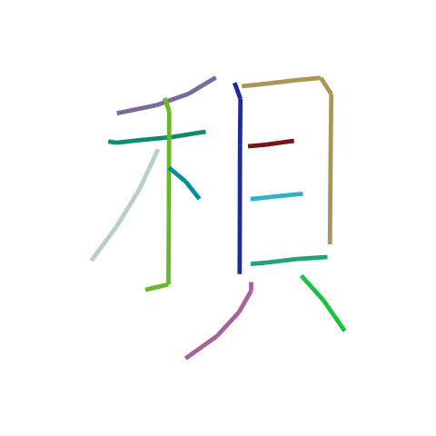
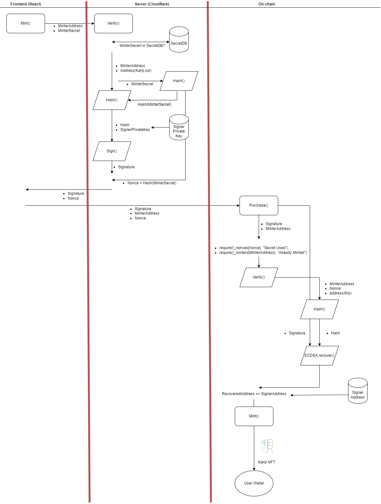

# Mint AI Generated Kanji NFTs

> You can find a little more information in this [blog post](https://jansonmak.com/minting-nfts-with-ecdsa-signatures) I wrote.

It is common for NFT projects to rely on a "Whitelist" to control who can mint their NFTs.

This project implements the ECDSA signatures approach with random alphanumeric strings (Secrets) that are given to users who are allowed to mint. Compare to the common approach of using wallet addresses, using secrets allow the users to use any wallets they wish. Users can also decide on the wallet at the time of minting.

## Demo

https://kanji-nft-ecdsa.jansonmak.com/

## Kanjis



The NFTs that you'll be minting are AI generated Kanjis that were produced with [sketch-rnn](https://github.com/hardmaru/sketch-rnn). You can see the collection that has been minted so far in this [OpenSea Collection](https://testnets.opensea.io/collection/kanji-v3).

## Secrets

The secrets are 80 of the most common pinyins for Kanji. Here's a [hint](https://www.google.com/search?q=most+common+chinese+words+pinyin&rlz=1C1GCEA_enHK998HK998&oq=most+common+&aqs=chrome.1.69i57j69i59j0i512l8.4421j0j7)

## Architecture

There are 3 components to this project:

1. React for frontend
2. Cloudflare for server
3. Solidity for smart contract

The flow of the minting process is illustrated in the diagram below.



### Refinement for production

- the signing Private Key should not be stored on the server. The sigatures for all secerts should be pre-generated and stored on the server instead. When a secret is submitted, a lookup of the relevant signature (if the secret is valid) is performed and returned to the user. This prevents the private key from being lost or fall into the wrong hands.
- include chain.id in the signature to prevent a testnet/mainnet replay attack

## Setup

### Require

1. Contract Deployment/Owner Account
2. Server Signing Account
3. Payout Address
4. Contract Address
5. Contract ABI

### Procedure

1. Update `.env`
2. Update & deploy `Kanji.sol`
   1. `npx hardhat node`
   2. `npx hardhat run scripts/01-deploy_kanji.ts --network localhost`
   3. Get <CONTRACT_ADDRESS>
3. Update & Deploy React App
   1. Update `Kanji.json` & Kanji address
4. Deploy Cloudflare Worker `index.js`
   1. `wrangler publish`
5. Update Cloudflare ENV variables (CONTRACT_ADDRESS & PRIVATE_KEY)
6. Update Cloudflare KV KANJI_SECRET

### Verify Contract on Etherscan

```shell
npx hardhat clean

npx hardhat verify --network rinkeby <CONTRACT_ADDRESS>
```
